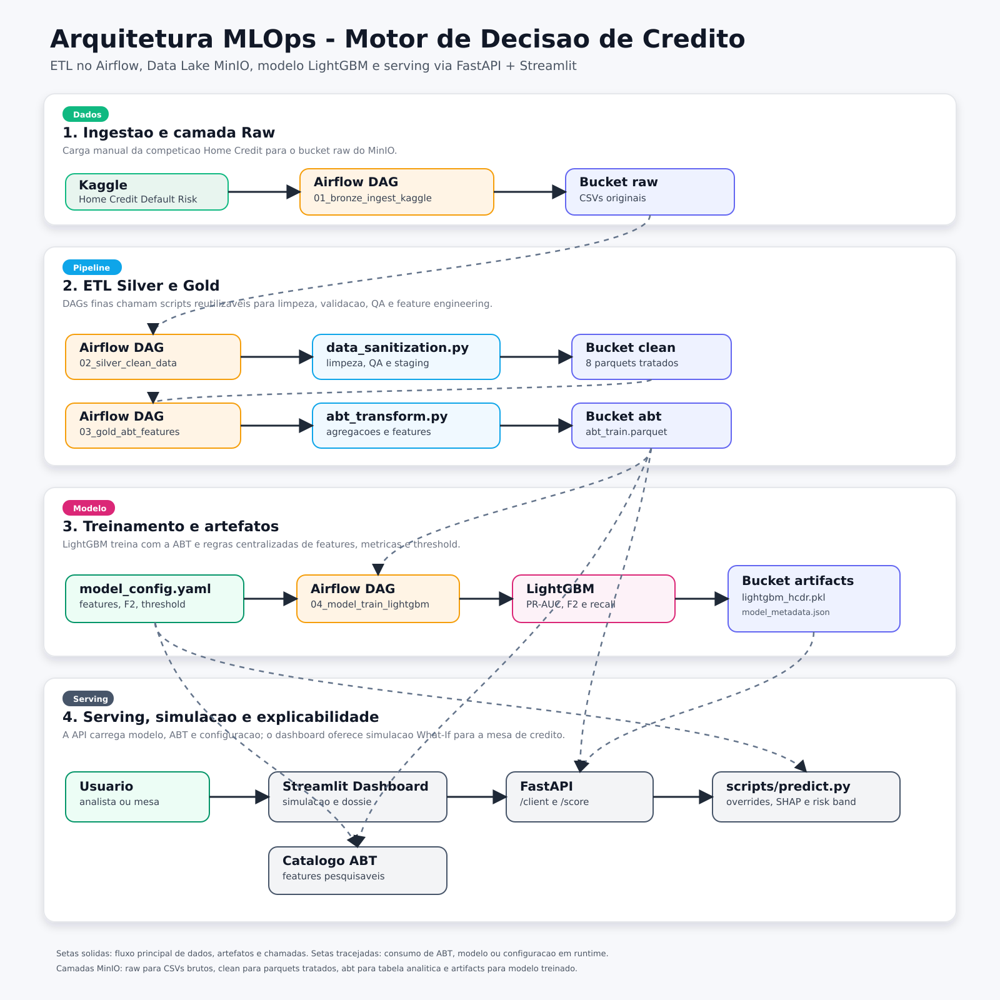

# Home Credit Default Risk - Motor de Decisão de Crédito

Projeto final de MLOps para risco de crédito, baseado na competição Kaggle
Home Credit Default Risk. A solução implementa uma esteira completa para
baixar dados brutos, transformar bases transacionais em uma ABT de modelagem,
treinar um modelo LightGBM e disponibilizar um serviço de predição consumido por
um dashboard de simulação para a mesa de crédito.

**Entrega individual (MLOps):** arquitetura, Docker Compose, monitoramento (iii)
e automação com agentes (iv) estão documentados em
[`MLOps/Readme.md`](MLOps/Readme.md).

## Objetivo de negócio

O projeto apoia a decisão de concessão de crédito em um contexto no qual os
erros são assimétricos. Recusar um bom pagador reduz receita e oportunidade
comercial; aprovar um cliente que inadimplirá pode gerar perda direta de
crédito, custo de cobrança, provisão e deterioração da carteira.

Por isso, a modelagem prioriza a redução de falsos negativos: clientes
historicamente inadimplentes que seriam aprovados pelo motor. A solucao busca
combinar inclusão, critério de risco e explicabilidade para permitir aprovar
melhor, recusar com mais fundamento e proteger a margem da operação.

## Metodologia

A abordagem segue uma esteira MLOps local, containerizada e reprodutível:

- **Análise exploratória:** o notebook `notebooks/01_exp_analysis.ipynb` foi
  usado para conhecer as bases, distribuições, nulos e relações iniciais entre
  variáveis.
- **Ingestão:** a DAG `01_bronze_ingest_kaggle` baixa os CSVs do Kaggle e
  publica os dados brutos no bucket `raw` do MinIO.
- **Camada Silver:** `scripts/data_sanitization.py` (DAG `02_silver_clean_data`)
  transforma oito arquivos de negocio em Parquets tratados, com QA antes da
  escrita no bucket `clean`.
- **Camada Gold / ABT:** `scripts/abt_transform.py` (DAG `03_gold_abt_features`)
  agrega historicos de bureau, cartao, propostas anteriores, POS/CASH e
  pagamentos para gerar `abt_train.parquet` no bucket `abt`.
- **Modelagem:** a análise comparativa de modelos foi feita no notebook
  `notebooks/02_model_evaluation.ipynb`. A partir dessa comparação, o LightGBM foi
  escolhido como modelo campeão e seu treino foi consolidado em
  `Model/train.py` / `notebooks/03_train_exploration.ipynb`, usando `Model/model_config.yaml`
  para features, splits, métricas e threshold.
- **Orquestração:** as DAGs Airflow encadeiam a esteira; o equivalente CLI é
  `scripts/pipeline_orchestration.py`.
- **Serving:** `scripts/predict.py` alimenta a FastAPI e o Streamlit com
  consulta de cliente, escoragem e simulações What-If com explicabilidade local.

As métricas de negócio incluem PR-AUC, F2-Score, recall da classe inadimplente,
falsos negativos, falsos positivos e taxa de reprovação no threshold
operacional.

## Arquitetura da solução

<p align="center">
  
</p>

Arquivos da arquitetura: [`PNG`](docs/architecture/arquitetura-mlops-home-credit.png) e
[`SVG`](docs/architecture/arquitetura-mlops-home-credit.svg).

Componentes principais:

- **Airflow:** orquestra as DAGs manuais de ingestão, ETL, ABT e treinamento.
- **MinIO S3:** organiza o Data Lake local nos buckets `raw`, `clean`, `abt` e
  `artifacts`.
- **Scripts Python:** concentram transformações, validações, pipelines e
  inferência para manter DAGs finas.
- **LightGBM:** modelo supervisionado usado para predizer probabilidade de
  inadimplência.
- **FastAPI:** serviço de predição com endpoints de health check, consulta de
  cliente e escoragem.
- **Streamlit:** interface de negócio para consulta, simulação de variáveis e
  leitura dos fatores explicativos.

### Interface Streamlit (estado atual)

O dashboard principal (`app/dashboard.py`) foi organizado para leitura executiva
em quatro abas:

- `Mesa de Crédito`
- `Dicionário de Variáveis`
- `Performance e ROI`
- `Monitoramento MLOps`

No cabeçalho da aplicação:

- título institucional: `Motor de Decisão de Crédito — Home Credit`
- autoria: `Anderson Nunes`

## Pre-requisitos

1. Docker e Docker Compose instalados.
2. Token da API Kaggle em `~/.kaggle/access_token` (gerado em
   [kaggle.com/settings/api](https://www.kaggle.com/settings/api) → *Generate New Token*).
   Alternativa: variável de ambiente `KAGGLE_API_TOKEN`.
3. Porta local livre para os servicos principais: `8080`, `9000`, `9001`,
   `8000` e `8501`.

### Nota sobre dependências (app x orquestrador)

- `requirements.txt` concentra dependências do runtime de app/pipeline Python
  (API, Streamlit e scripts de dados/modelo).
- O Apache Airflow é provido pela imagem base do serviço `airflow`
  (`apache/airflow:3.1.2-python3.13`) definida em `Dockerfile.airflow`.
- Pacotes extras específicos do orquestrador são instalados via
  `requirements-airflow.txt`.

## Como treinar o modelo

Suba a infraestrutura:

```bash
docker compose build
docker compose up -d minio airflow
```

*(Aguarde aproximadamente 1 a 2 minutos para a inicialização completa do Airflow e do banco de dados interno.)*

Na inicialização, o container do Airflow executa `airflow db migrate` e
`airflow dags reserialize` antes do `airflow standalone`. Isso garante que, em
clones limpos, as DAGs montadas em `./dags` sejam serializadas no banco local e
apareçam na listagem/UI sem comando manual adicional.

O Airflow também usa hostname fixo `airflow` e define
`AIRFLOW__CORE__HOSTNAME_CALLABLE=scripts.airflow_config.get_airflow_hostname`
para evitar URLs internas de logs sem host, como `http://:8793/log/...`, em
ambientes Docker diferentes.

### 2. Executar o Pipeline de Dados e Treinamento (Airflow)

1. Acesse o orquestrador: **`http://localhost:8080`** (auth local via SimpleAuthManager: `admin` / `admin`).
2. Despause as quatro DAGs da esteira Medalhão e dispare apenas a primeira; as demais são acionadas automaticamente via `TriggerDagRunOperator`:
   * `01_bronze_ingest_kaggle` — ingestão dos CSVs brutos no bucket `raw` → dispara Silver
   * `02_silver_clean_data` — padronização e validação no bucket `clean` → dispara Gold
   * `03_gold_abt_features` — feature engineering e ABT no bucket `abt` → dispara treino
   * `04_model_train_lightgbm` — treinamento a partir de `s3://abt/abt_train.parquet` e exportação do modelo para `s3://artifacts/lightgbm_hcdr.pkl`

Equivalente via CLI:

```bash
docker compose exec -T airflow airflow dags unpause 01_bronze_ingest_kaggle
docker compose exec -T airflow airflow dags unpause 02_silver_clean_data
docker compose exec -T airflow airflow dags unpause 03_gold_abt_features
docker compose exec -T airflow airflow dags unpause 04_model_train_lightgbm
docker compose exec -T airflow airflow dags trigger 01_bronze_ingest_kaggle
```

Todas as DAGs são manuais (`schedule=None`); o encadeamento Bronze → Silver → Gold → Model é automático após o trigger inicial.

Saidas esperadas:

- `raw`: 10 CSVs da competicao Kaggle.
- `clean`: Parquets Silver tratados e validados.
- `abt`: `abt_train.parquet` e `abt_demo_holdout.parquet`.
- `artifacts`: `lightgbm_hcdr.pkl` e `model_metadata.json`.

Dados oficiais de runtime ficam no MinIO (S3). Arquivos sob `Dados/` sao
apenas staging/debug e nao competem com o lake.

Para inspecionar objetos no MinIO:

```bash
docker compose run --rm minio-client ls --recursive local/artifacts
docker compose run --rm minio-client stat local/abt/abt_train.parquet
```

## Execução do serviço de predição

Depois de treinar o modelo e publicar os artefatos no MinIO, suba a API:

```bash
docker compose up -d api
```

Valide o health check:

```bash
curl -sS http://localhost:8000/
```

Consulte o dossiê de um cliente do holdout de demonstração:

```bash
curl -sS http://localhost:8000/client/139767
```

Execute uma escoragem sem alterações:

```bash
curl -sS -X POST http://localhost:8000/score \
  -H 'Content-Type: application/json' \
  -d '{"client_id":139767,"features_override":{}}'
```

Execute uma simulação What-If com override de features:

```bash
curl -sS -X POST http://localhost:8000/score \
  -H 'Content-Type: application/json' \
  -d '{"client_id":139767,"features_override":{"AMT_CREDIT":500000,"AMT_ANNUITY":25000}}'
```

Para usar a interface de negócio:

```bash
docker compose up -d streamlit
```

Acesse `http://localhost:8501`. O dashboard consome a API internamente via
`API_BASE_URL=http://api:8000`.

## Próximos passos de desenvolvimento

Os itens **iii** (monitoramento) e **iv** (automação) possuem implementação
operacional:

- Monitoramento: DAG `05_monitor_health` / `POST /monitoring/run` →
  `s3://artifacts/monitoring/latest.json` (saúde, artefatos, PSI/drift, schema, baseline)
- Automação: triagem pós-`/score` e `POST /webhooks/credit-decision` →
  `s3://artifacts/automation/`

Detalhes em [`MLOps/Readme.md`](MLOps/Readme.md) e na documentação
[`docs/architecture/mlops-monitoramento-e-automacao.md`](docs/architecture/mlops-monitoramento-e-automacao.md).

Evoluções futuras (agentes de IA para pareceres em linguagem natural, jobs
agendados de PSI em janela viva) permanecem no roadmap, sempre com humano no loop.


## Documentação

Detalhes operacionais e técnicos ficam em [`docs/README.md`](docs/README.md):

- `docs/architecture/ambiente-docker-e-dados.md`: ambiente Docker, servicos e volumes.
- `docs/pipeline/camada-silver.md`: transformações, staging e QA de `raw` para `clean`.
- `docs/pipeline/camada-gold-abt-design.md`: transformações, staging e QA de `clean`
  para `abt`.
- `docs/operations/catalogo-abt.md`: dicionario de variaveis da ABT no Streamlit.
- `docs/pipeline/dags/README.md`: índice e comandos das DAGs manuais.
- `docs/modeling/exemplos-confusion-matrix.md`: exemplos de TN, TP, FN e FP.
- `docs/operations/minio-client.md`: inspeção e cópia de objetos no MinIO.
- `docs/modeling/model-config.md`: guia do `Model/model_config.yaml`.
- `docs/architecture/mlops-monitoramento-e-automacao.md`: proposta de monitoramento (iii) e
  de automação / agentes de IA (iv).

## Validação básica

Depois de alterar DAGs, scripts ou testes, rode validações proporcionais:

```bash
bash scripts/dev/validate_pre_defesa.sh
```

Ou, manualmente:

```bash
docker compose exec -T airflow python -m pytest /opt/airflow/tests -q
docker compose exec -T airflow airflow dags list-import-errors
docker compose exec -T airflow airflow dags list
```

Todo módulo, classe, helper, fixture e função de teste Python novo deve possuir
docstring em português. A suíte usa `pytest` e `pytest-mock`.

Markers oficiais (`pytest.ini` / `tests/conftest.py`):

- `streamlit` — testes da UI/catalogo (container `dev`)
- `airflow` — testes de DAGs (container `airflow`)

Exemplo:

```bash
docker compose exec -T airflow python -m pytest /opt/airflow/tests -m "not streamlit" -q
docker compose exec -T dev python -m pytest tests -m streamlit -q
```