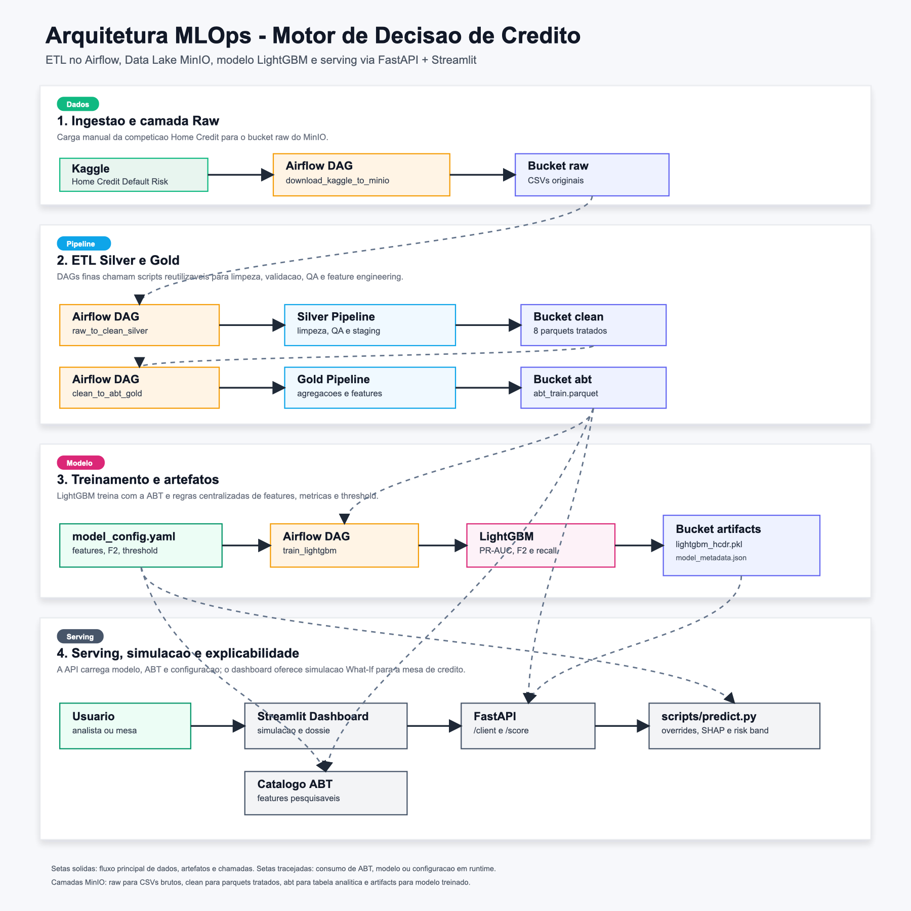

# Home Credit Default Risk - Motor de Decisao de Credito

Projeto final de MLOps para risco de credito, baseado na competicao Kaggle
Home Credit Default Risk. A solucao implementa uma esteira completa para
baixar dados brutos, transformar bases transacionais em uma ABT de modelagem,
treinar um modelo LightGBM e disponibilizar um servico de predicao consumido por
um dashboard de simulacao para a mesa de credito.

## Objetivo De Negocio

O projeto apoia a decisao de concessao de credito em um contexto no qual os
erros sao assimetricos. Recusar um bom pagador reduz receita e oportunidade
comercial; aprovar um cliente que inadimplira pode gerar perda direta de
credito, custo de cobranca, provisao e deterioracao da carteira.

Por isso, a modelagem prioriza a reducao de falsos negativos: clientes
historicamente inadimplentes que seriam aprovados pelo motor. A solucao busca
combinar inclusao, criterio de risco e explicabilidade para permitir aprovar
melhor, recusar com mais fundamento e proteger a margem da operacao.

## Metodologia

A abordagem segue uma esteira MLOps local, containerizada e reprodutivel:

- **Analise exploratoria:** o notebook `notebooks/01_exp_analysis.ipynb` foi
  usado para conhecer as bases, distribuicoes, nulos e relacoes iniciais entre
  variaveis.
- **Ingestao:** a DAG `01_bronze_ingest_kaggle` baixa os CSVs do Kaggle e
  publica os dados brutos no bucket `raw` do MinIO.
- **Camada Silver:** `scripts/data_sanitization.py` (DAG `02_silver_clean_data`)
  transforma oito arquivos de negocio em Parquets tratados, com QA antes da
  escrita no bucket `clean`.
- **Camada Gold / ABT:** `scripts/abt_transform.py` (DAG `03_gold_abt_features`)
  agrega historicos de bureau, cartao, propostas anteriores, POS/CASH e
  pagamentos para gerar `abt_train.parquet` no bucket `abt`.
- **Modelagem:** a analise comparativa de modelos foi feita no notebook
  `notebooks/02_model_evaluation.ipynb`. A partir dessa comparacao, o LightGBM foi
  escolhido como modelo campeao e seu treino foi consolidado em
  `scripts/train.py` / `notebooks/03_train_exploration.ipynb`, usando `config/model_config.yaml`
  para features, splits, metricas e threshold.
- **Orquestracao:** as DAGs Airflow encadeiam a esteira; o equivalente CLI e
  `scripts/pipeline_orchestration.py`.
- **Serving:** `scripts/predict.py` alimenta a FastAPI e o Streamlit com
  consulta de cliente, escoragem e simulacoes What-If com explicabilidade local.

As metricas de negocio incluem PR-AUC, F2-Score, recall da classe inadimplente,
falsos negativos, falsos positivos e taxa de reprovacao no threshold
operacional.

## Arquitetura Da Solucao

<p align="center">
  
</p>

Arquivos da arquitetura: [`PNG`](docs/arquitetura-mlops-home-credit.png) e
[`SVG`](docs/arquitetura-mlops-home-credit.svg).

Componentes principais:

- **Airflow:** orquestra as DAGs manuais de ingestao, ETL, ABT e treinamento.
- **MinIO S3:** organiza o Data Lake local nos buckets `raw`, `clean`, `abt` e
  `artifacts`.
- **Scripts Python:** concentram transformacoes, validacoes, pipelines e
  inferencia para manter DAGs finas.
- **LightGBM:** modelo supervisionado usado para predizer probabilidade de
  inadimplencia.
- **FastAPI:** servico de predicao com endpoints de health check, consulta de
  cliente e escoragem.
- **Streamlit:** interface de negocio para consulta, simulacao de variaveis e
  leitura dos fatores explicativos.

## Pre-Requisitos

1. Docker e Docker Compose instalados.
2. Credenciais Kaggle em `~/.kaggle/kaggle.json`.
3. Porta local livre para os servicos principais: `8080`, `9000`, `9001`,
   `8000` e `8501`.

## Como Treinar O Modelo

Suba a infraestrutura:

```bash
docker compose build
docker compose up -d minio airflow
```

*(Aguarde aproximadamente 1 a 2 minutos para a inicialização completa do Airflow e do banco de dados interno.)*

Na inicialização, o container do Airflow executa `airflow db migrate` e
`airflow dags reserialize` antes do `airflow standalone`. Isso garante que, em
clones limpos, as DAGs montadas em `./dags` sejam serializadas no banco local e
apareçam na listagem/UI sem comando manual adicional.

O Airflow também usa hostname fixo `airflow` e define
`AIRFLOW__CORE__HOSTNAME_CALLABLE=scripts.airflow_config.get_airflow_hostname`
para evitar URLs internas de logs sem host, como `http://:8793/log/...`, em
ambientes Docker diferentes.

### 2. Executar o Pipeline de Dados e Treinamento (Airflow)

1. Acesse o orquestrador: **`http://localhost:8080`** (auth local via SimpleAuthManager: `admin` / `admin`).
2. Despause as quatro DAGs da esteira Medalhão e dispare apenas a primeira; as demais são acionadas automaticamente via `TriggerDagRunOperator`:
   * `01_bronze_ingest_kaggle` — ingestão dos CSVs brutos no bucket `raw` → dispara Silver
   * `02_silver_clean_data` — padronização e validação no bucket `clean` → dispara Gold
   * `03_gold_abt_features` — feature engineering e ABT no bucket `abt` → dispara treino
   * `04_model_train_lightgbm` — treinamento a partir de `s3://abt/abt_train.parquet` e exportação do modelo para `s3://artifacts/lightgbm_hcdr.pkl`

Equivalente via CLI:

```bash
docker compose exec -T airflow airflow dags unpause 01_bronze_ingest_kaggle
docker compose exec -T airflow airflow dags unpause 02_silver_clean_data
docker compose exec -T airflow airflow dags unpause 03_gold_abt_features
docker compose exec -T airflow airflow dags unpause 04_model_train_lightgbm
docker compose exec -T airflow airflow dags trigger 01_bronze_ingest_kaggle
```

Todas as DAGs são manuais (`schedule=None`); o encadeamento Bronze → Silver → Gold → Model é automático após o trigger inicial.

Saidas esperadas:

- `raw`: 10 CSVs da competicao Kaggle.
- `clean`: Parquets Silver tratados e validados.
- `abt`: `abt_train.parquet`.
- `artifacts`: `lightgbm_hcdr.pkl` e `model_metadata.json`.
- `Dados/abt/abt_demo_holdout.parquet`: holdout local para demonstracao na API
  e no dashboard.

Para inspecionar objetos no MinIO:

```bash
docker compose run --rm minio-client ls --recursive local/artifacts
docker compose run --rm minio-client stat local/abt/abt_train.parquet
```

## Execucao Do Servico De Predicao

Depois de treinar o modelo e publicar os artefatos no MinIO, suba a API:

```bash
docker compose up -d api
```

Valide o health check:

```bash
curl -sS http://localhost:8000/
```

Consulte o dossie de um cliente do holdout de demonstracao:

```bash
curl -sS http://localhost:8000/client/139767
```

Execute uma escoragem sem alteracoes:

```bash
curl -sS -X POST http://localhost:8000/score \
  -H 'Content-Type: application/json' \
  -d '{"client_id":139767,"features_override":{}}'
```

Execute uma simulacao What-If com override de features:

```bash
curl -sS -X POST http://localhost:8000/score \
  -H 'Content-Type: application/json' \
  -d '{"client_id":139767,"features_override":{"AMT_CREDIT":500000,"AMT_ANNUITY":25000}}'
```

Para usar a interface de negocio:

```bash
docker compose up -d streamlit
```

Acesse `http://localhost:8501`. O dashboard consome a API internamente via
`API_BASE_URL=http://api:8000`.

## Proximos Passos De Desenvolvimento

Os itens **iii** (monitoramento em producao) e **iv** (acoes automatizadas e
agentes de IA) do enunciado individual estao documentados como proposta
teorica em
[`docs/mlops-monitoramento-e-automacao.md`](docs/mlops-monitoramento-e-automacao.md).

Resumo:

- **Monitoramento:** saude da API e das DAGs, drift e qualidade dos dados,
  acompanhamento de PR-AUC / F2 / FN-FP e do `business_threshold` contra a
  linha de base em `model_metadata.json`, com runbook de resposta.
- **Automacao e agentes:** triagem da fila de credito, dossie assistido para
  a mesa, alertas de concentracao de risco, ciclo de retreino com aprovacao
  humana e pareceres de explicabilidade a partir do `/score` — sempre com
  humano no loop.

Demais evolucoes de modelagem (threshold, features, interpretabilidade) seguem
subordinadas a essa governanca operacional.


## Documentacao

Detalhes operacionais e tecnicos ficam em `docs/`:

- `docs/ambiente-docker-e-dados.md`: ambiente Docker, servicos e volumes.
- `docs/camada-silver.md`: transformacoes, staging e QA de `raw` para `clean`.
- `docs/camada-gold-abt-design.md`: transformacoes, staging e QA de `clean`
  para `abt`.
- `docs/catalogo-abt.md`: catalogo pesquisavel da ABT no Streamlit.
- `docs/dags/README.md`: indice e comandos das DAGs manuais.
- `docs/exemplos-confusion-matrix.md`: exemplos de TN, TP, FN e FP.
- `docs/minio-client.md`: inspecao e copia de objetos no MinIO.
- `docs/model-config.md`: guia do `config/model_config.yaml`.
- `docs/mlops-monitoramento-e-automacao.md`: proposta de monitoramento (iii) e
  de automacao / agentes de IA (iv).

## Validacao Basica

Depois de alterar DAGs, scripts ou testes, rode validacoes proporcionais:

```bash
docker compose exec -T airflow python -m pytest /opt/airflow/tests -q
docker compose exec -T airflow airflow dags list-import-errors
docker compose exec -T airflow airflow dags list
```

Todo modulo, classe, helper, fixture e funcao de teste Python novo deve possuir
docstring em portugues. A suite usa `pytest` e `pytest-mock`.
